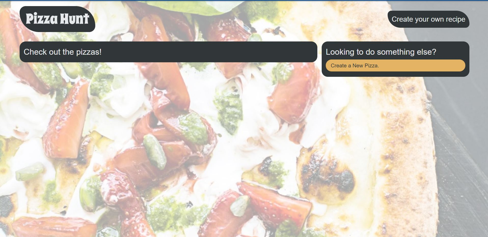

<!-- PROJECT TITE -->
  <h1 align="center">Pizza Hunt</h1>
  
  <!-- DESCRIPTION -->
  

  Site to create your own pizzas, make them flavourfull and enjoy your creations. Using Mongoo it keeps track of the DB and allows users to see and comment on their creations

  <!-- DEPLOYED LINK -->
  Video: https://obscure-crag-00996.herokuapp.com/ 
  GitHub repository URL: https://github.com/SaidHadad/Pizza-Hunt

  <!-- TABLE OF CONTENTS -->
  

  
Table of Contents

  <ol>
  <li><a href="#about-the-project">About The Project</a></li>
  <li><a href="#built-with">Built With</a></li>
  <li>
    <a href="#getting-started">Getting Started</a>
    <ul>
    <li><a href="#prerequisites">Prerequisites</a></li>
    <li><a href="#installation">Installation</a></li>
    </ul>
    </li>
  <li><a href="#contributing">Contributing</a></li>
  <li><a href="#license">License</a></li>
  <li><a href="#contact">Contact</a></li>
  </ol>
  

  
  
  <!-- ABOUT THE PROJECT -->
  ## About The Project

    
  Pizza Hunt Website
  
  ## Built With

  * JavaScript
  * Node.js
  * MongoDB
  * Mongoose
  * Express.js
  
  <!-- GETTING STARTED -->
  
  ## Getting Started

  ### Prerequisites

  * MongoDB
  * REST API Client

  ### Installation
  Download or clone the repo, run npm -i yes to check on the dependencies or just visit the heroku deployed app

  <!-- CONTRIBUTING -->
    
  <!-- LICENSE -->
  
  ## License

 

[MIT License](https://choosealicense.com/licenses/mit/)  
  
  <!-- CONTACT -->
  
  ## Contact
  Name: Said David Hadad  
  Email: saiddavid.hadad@gmail.com  
  GIT: https://github.com/SaidHadad  